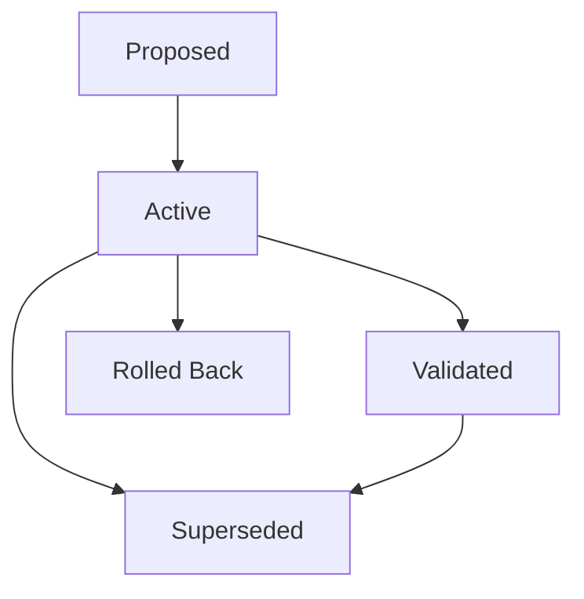

# Dev Atlas

> **Cross-Role Project Memory & Engineering Command Center**  
> An autonomous, high-contrast engineering operating system bridging the gap between **Product, Design, Engineering, QA, and Operations** with an integrated institutional memory ledger.

---

## 📌 Problem Statement (PS)

Modern software organizations suffer from severe **Institutional Amnesia**:

1. **Context Fragmentation**: Architectural decisions are buried in Slack threads, PR descriptions, Jira tickets, and Google Docs that are never cross-referenced.
2. **The "Why" is Lost**: Engineers know *what* code changed from git commits, but cannot discover *why* an API contract was altered, *why* a PRD scope was reduced, or *why* a Figma spec was intentionally bypassed.
3. **Cross-Discipline Friction**:
   - **Product Managers** lose track of customer-driven scope tradeoffs.
   - **Designers** struggle to track code vs. token drift and accessibility exceptions.
   - **Engineers** inherit technical debt without knowing the historical rationale or superseded ADRs.
   - **QA Engineers** lack immediate visibility into regression root causes and active security waivers.
   - **Site Reliability Engineers (Ops)** struggle during 3 AM incidents to understand rollback justifications and circuit breaker configurations.
4. **Onboarding & Handover Overhead**: New hires and rotating on-call engineers spend weeks reconstructing mental context that should be immediately queryable.

---

## 🚀 The Solution: Dev Atlas

**Dev Atlas** solves institutional amnesia by serving as a **single source of truth and closed-loop command center** for the entire product delivery lifecycle:

- **Role-Focused Workspaces**: Dedicated perspectives tailored specifically to **Product (`pm`)**, **Design (`designer`)**, **Engineering (`dev`)**, **QA & Security (`qa`)**, and **Operations (`ops`)**, plus an **Executive Pulse (`all`)**.
- **Institutional Memory & Change Rationale OS**: Every significant architecture decision, scope revision, design token diff, regression RCA, and rollback is recorded with **Rationale**, **Before/After Diffs**, **Impact Metrics**, and **Evidence Links**.
- **Synchronized Navigation**: Top navbar role switching automatically syncs the sidebar options and lands users directly in their primary discipline workspace.
- **Offline-First & Zero Friction**: 100% in-memory state with automatic `localStorage` persistence — no database setup, no auth walls, instant boot time.
- **WCAG AA Accessible**: High-contrast typography (5.9:1+ contrast ratio), full keyboard navigation with visible focus rings, and mobile-responsive layout.

---

## 🎯 Role Perspectives & Feature Matrix

### 🌐 1. Executive & Overview (`All`)
*Designed for engineering leads, VPs of Engineering, and founders.*
- **Executive Health Pulse**: Real-time composite health score gauge calculated across sentiment, velocity, stability, and token fidelity.
- **Cross-Functional Lifecycle Radar**: 6 cross-team KPI cards tracking User Sentiment, Checkout Reliability, Sprint Velocity, UX Health, QA Pass Rate, and Production Uptime.
- **Critical Telemetry Spotlight**: Real-time P0 hotspot alerts with AI-generated root-cause diagnoses.
- **Cross-Disciplinary Project Memory Ledger**: High-level timeline of decisions across all disciplines.

### 📊 2. Product Management (`Product`)
*Designed for PMs, Group Product Managers, and Product Owners.*
- **PRD & Scope Evolution**: Track requirement specifications, stage transitions, and scope boundaries.
- **Prioritization Trade-offs**: Document why features were deferred or accelerated to P0.
- **Customer-Driven Rationale**: Link feature changes directly to customer feedback clusters and upvote signals.
- **Measured Business Impact**: Track observed ROI, conversion deltas, and business lift post-launch.
- **Features Directory & Strategic Roadmap**: Manage quarterly epics and feature milestones.

### 🎨 3. Design System & UX Validation (`Design`)
*Designed for Product Designers, Design Technologists, and Design System Leads.*
- **Validation Studio (Signature)**: Interactive side-by-side visual diff inspector comparing live code against Figma specifications with pin-point spatial annotations.
- **Design Token Library**: Real-time token registry for colors, typography, spacing, and elevation with AAA contrast verification.
- **Figma Specs Inspector**: Frame-level design spec inspector with inspectable layouts and component variants.
- **Design Review Threads**: Contextual review threads linking feedback to visual components.
- **Design Memory & Specs**: Log Figma exceptions, usability lab evidence, and touch-target waivers.

### 💻 4. Engineering & Architecture (`Eng`)
*Designed for Software Engineers, Tech Leads, and System Architects.*
- **Developer Kanban**: Interactive sprint board with drag-and-drop task lifecycle management (`Todo`, `In-Progress`, `Code Review`, `Done`).
- **Sprint & PR Tracker**: Real-time pull request tracker with branch names, reviewers, and build statuses.
- **Sandbox Builds & CI**: Sandbox environment runner with live build logs and artifact downloads.
- **Engineering Architecture & ADRs**: Architecture Decision Records documenting API contracts, latency optimizations, and superseded tech debt.
- **AI Prompt Builder**: Engineering prompt studio tailored for LLM code generation and architecture analysis.

### 🧪 5. QA & Security Gating (`QA`)
*Designed for QA Engineers, SDETs, and Security Engineers.*
- **Security Command Center**: OWASP vulnerability scanner, risk acceptance waivers, and automated security gate verification.
- **Acceptance Test Matrix**: Full test case runner tracking automated and manual test pass/fail rates.
- **Bug Tracker**: Priority-ranked defect tracker with severity tagging (`P0`, `P1`, `P2`), reproduction steps, and root-cause analyses (RCA).
- **Release Readiness Gate**: Algorithmic release readiness score (0-100%) blocking risky releases based on test pass rates and unresolved critical bugs.
- **QA Lineage & Memory**: Log regression root causes, security waivers, and gate blockers.

### 🚀 6. Production Telemetry & Operations (`Ops`)
*Designed for SREs, DevOps Engineers, and On-Call Responders.*
- **Product Health Radar**: Telemetry monitor tracking P99 latency, error budgets, and uptime across microservices.
- **Releases & Sentiment Deltas**: Version release tracker with post-deployment sentiment analysis and crash-rate deltas.
- **Production Incidents**: Incident response timeline tracking SEV-1/SEV-2 outages with root-cause post-mortems.
- **System Maintenance**: Scheduled maintenance windows and database migration tracker.
- **Ops Memory & Rollbacks**: Document rollback justifications, circuit breaker configurations, and MTTR metrics.

---

## 🧠 Project Memory & Change Rationale OS

The Project Memory ledger is Dev Atlas's institutional brain. Every decision follows an immutable state lifecycle:



### Memory Record Schema
Each memory event captures complete contextual lineage:
- **`title`**: Descriptive title of the change or decision.
- **`role`**: Discipline lens (`all`, `pm`, `designer`, `dev`, `qa`, `ops`).
- **`whyChanged`**: Human-readable rationale explaining the business or technical motivation.
- **`fieldChanges`**: Array of before/after diffs (`label`, `before`, `after`).
- **`observedImpact`**: Quantified outcomes (`metric`, `delta`, `unit`).
- **`evidence`**: Supporting evidence links to PRDs, commits, Figma frames, or incident reports.
- **`state`**: Current lifecycle state (`proposed`, `active`, `validated`, `superseded`, `rolled-back`).
- **`supersedesMemoryEventId`**: Reference to the previous decision this record replaces.

---

## 🛠️ Technology Stack

| Component | Technology | Rationale |
| :--- | :--- | :--- |
| **Framework** | [React 18](https://react.dev/) + [TypeScript](https://www.typescriptlang.org/) | Type-safe UI components with strict interface contracts |
| **Build Tool** | [Vite 6](https://vitejs.dev/) with [@vitejs/plugin-react-swc](https://github.com/vitejs/vite-plugin-react-swc) | Sub-300ms HMR and ultra-fast 3.6s production builds |
| **Styling** | [Tailwind CSS 3](https://tailwindcss.com/) + Custom CSS Tokens | Utility-first styling with high-contrast accessibility utilities |
| **Icons** | [Lucide React](https://lucide.dev/) | Consistent, lightweight iconography across all workflows |
| **State & Storage** | React Context + `localStorage` | Zero backend dependency; fully functional offline |
| **Accessibility** | WCAG AA / AAA | Minimum 5.9:1 text contrast, focus rings, touch targets |

---

## 📦 Getting Started

### Prerequisites
- **Node.js**: `v18.0.0` or higher
- **Package Manager**: `npm` or `pnpm`

### Installation

1. **Clone the repository**:
   ```bash
   git clone https://github.com/tnex0734-ops/Dev-Atlas.git
   cd Dev-Atlas
   ```

2. **Install dependencies**:
   ```bash
   npm install
   ```

3. **Start the development server**:
   ```bash
   npm run dev
   ```
   Open [http://localhost:5173](http://localhost:5173) in your browser.

4. **Build for production**:
   ```bash
   npm run build
   ```

5. **Preview production build**:
   ```bash
   npm run preview
   ```

---

## ⌨️ Accessibility & Keyboard Shortcuts

- **Universal Search & Command Palette**: Press <kbd>⌘K</kbd> (Mac) or <kbd>Ctrl+K</kbd> (Windows/Linux) to instantly search across PRDs, Kanban tasks, context blocks, and memory records.
- **Keyboard Navigation**: Full <kbd>Tab</kbd> and <kbd>Shift+Tab</kbd> support with high-contrast focus rings (`ring-2 ring-neutral-900`) on all interactive controls.
- **Mobile Responsive**: Fully adaptive navigation drawer and scrollable role switcher on viewports from 375px to 4K displays.

---

## 📄 License

This project is licensed under the MIT License — see the [LICENSE](LICENSE) file for details.
